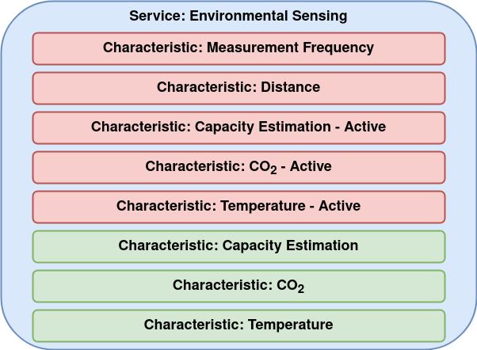

| Supported Targets | ESP32 |
| ----------------- | ----- |

ESP-IDF Gatt Server Service Table & Wi-Fi Provisioning
===============================================

This framework integrates a Gatt Server with a Wi-Fi provisioning application. The server exposes environmental sensing values, such as CO2 and temperature, as well as capacity estimation based on the RSSI of bluetooth devices. For handling the different devices and RSSI values, this project makes use of the hash table structure implemented by [uthash](http://troydhanson.github.io/uthash/).

The structure of the Gatt Server, its services and characteristics, are depicted in figure below:

